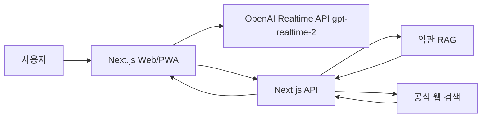

# PRD: DB손해보험 약관 기반 보이스 상담봇 MVP

## 목적

사용자가 음성으로 보험 약관, 보장 여부, 면책, 청구 서류를 질문하면 봇이 짧게 응답하고, 긴 약관 근거 답변은 채팅창에 가독성 있게 제공한다.

## MVP 목표

- 사용자가 음성으로 질문한다.
- Realtime 모델은 intent를 파악하고 필요한 경우 `prepare_policy_answer` 도구를 호출한다.
- 음성 응답은 "답변은 채팅창으로 보내드리겠습니다." 수준으로 제한한다.
- 채팅 답변은 요약, 적용 조건, 주의사항, 근거, 확인 필요 정보로 구성한다.
- 답변은 약관 조항/출처 기반이어야 하며 최종 지급 판단으로 단정하지 않는다.

## 대상 사용자

- DB손해보험 가입자 또는 가입 검토자
- 고객센터 상담 전 약관 내용을 빠르게 확인하려는 사용자
- 보험금 청구 전 필요 서류와 보장 조건을 알고 싶은 사용자

## 주요 intent

- `coverage_check`: 보장 가능성 확인
- `exclusion_check`: 면책/제외 여부 확인
- `claim_documents`: 청구 서류 안내
- `policy_explanation`: 약관 문구 설명
- `official_notice`: 최신 공시/공지 확인
- `handoff_required`: 상담원 연결 필요

## UX 원칙

- 음성은 짧고 확실하게 말한다.
- 긴 약관 설명은 채팅으로 보낸다.
- 채팅은 모바일에서도 읽기 쉽게 구조화한다.
- 약관 근거, 문서 버전, 페이지, URL을 표시한다.
- 계약별 판단이 필요한 경우 상담원 연결 또는 추가 정보 요청으로 전환한다.

## 시스템 아키텍처

## 데이터 요구사항

- 공식 약관 원문
- 상품명
- 약관 버전/시행일
- 조항명
- 페이지
- 원문 URL
- 청구 서류 안내
- 공지/공시 URL

## 답변 정책

- 약관 근거가 없으면 "확인 불가"로 응답한다.
- 지급 가능성을 단정하지 않는다.
- "최종 지급 여부는 보험사 심사와 계약 조건에 따라 달라질 수 있음"을 표시한다.
- 최신 정보는 공식 도메인 검색 결과만 사용한다.

## MVP 범위

Included:

- WebRTC 음성 연결
- intent 기반 tool call
- 샘플 약관 검색
- 채팅 답변 카드
- Realtime token server API

Not included:

- 실제 DB손해보험 약관 전체 인덱싱
- 사용자 계약 조회
- 본인 인증
- 상담원 CRM 연동
- 실제 보험금 청구 제출

## 다음 단계

1. DB손해보험 공식 약관 PDF 확보
2. PDF 조항 단위 파싱 및 metadata schema 확정
3. Vector Store 또는 pgvector 인덱스 연결
4. 공식 도메인 web search 필터링 연결
5. 상담원 연결/로그 저장/개인정보 정책 설계
